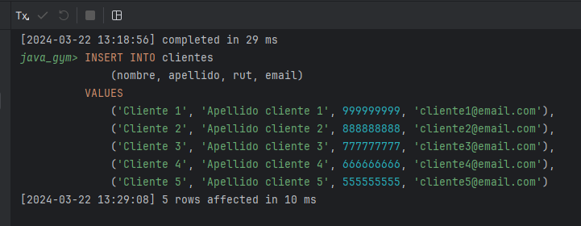

# MySQL

### New project
- [DB](https://github.com/TheNefelin/TalentoDigital_Java_2024/blob/main/M3/DB.sql) (MySQL)
- [DDL](https://github.com/TheNefelin/TalentoDigital_Java_2024/blob/main/M3/DDL.sql) (MySQL)
- [DML](https://github.com/TheNefelin/TalentoDigital_Java_2024/blob/main/M3/DML.sql) (MySQL)
- [Gym](https://github.com/TheNefelin/TalentoDigital_Java_2024/blob/main/M3/Gym.sql) (MySQL)
- [Peliculas](https://github.com/TheNefelin/TalentoDigital_Java_2024/blob/main/M3/Peliculas.sql) (MySQL)
- [viajeros_Dia05](https://github.com/TheNefelin/TalentoDigital_Java_2024/blob/main/M3/viajeros_Dia05.sql) (MySQL)
- [Banck_Dia06](https://github.com/TheNefelin/TalentoDigital_Java_2024/blob/main/M3/Banck_Dia06.sql) (MySQL)
- [Desafio_Dia06](https://github.com/TheNefelin/TalentoDigital_Java_2024/blob/main/M3/Desafio_Dia06.sql) (MySQL)
- [mawashi_DDL_Dia07](https://github.com/TheNefelin/TalentoDigital_Java_2024/blob/main/M3/mawashi_DDL_Dia07.sql) (MySQL)
- [Desafio_Peliculas_Dia09](https://github.com/TheNefelin/TalentoDigital_Java_2024/blob/main/M3/Desafio_Peliculas_Dia09.sql) (MySQL)
- [Desafio_Dia12](https://github.com/TheNefelin/TalentoDigital_Java_2024/blob/main/M3/Desafio_Dia12.jpg) (MySQL)
- [Prueba_Dia13](https://github.com/TheNefelin/TalentoDigital_Java_2024/blob/main/M3/Prueba_Dia13.sql) (MySQL)

# Java MySQL Gym

### Se subirá el ejercicio guiado al evaluado
```
- [x]  Todas las tablas deben tener ID.
- [x]  No usar el rut como Primary Key.
- [x]  El rut es un INT.
- [x]  Monto INT.
- [x]  Modificar el código de la inserción de datos.
- [x]  Pantallazos de los resultados.
- [ ]  Subir un word con el código SQL y pantallazos.
```
<hr>

### Paso 1: Creamos la base de datos.
```
CREATE DATABASE java_gym;
```


<hr>

### Paso 2: Nos conectamos a la base de datos.
```
USE java_gym;
```

<hr>

### Paso 3: Creamos la tabla clientes y Paso 4: El id es el PK.
```
CREATE TABLE clientes (
    id INT PRIMARY KEY AUTO_INCREMENT,
    nombre VARCHAR(50) NOT NULL,
    apellido VARCHAR(50) NOT NULL,
    rut INT NOT NULL,
    email VARCHAR(50) NOT NULL
);
```


<hr>

### Paso 5: Creamos la tabla matrículas.
```
CREATE TABLE matriculas (
    id INT PRIMARY KEY AUTO_INCREMENT,
    monto INT NOT NULL,
    estado TINYINT NOT NULL,
    id_cliente INT,
    FOREIGN KEY (id_cliente) REFERENCES  clientes(id)
);
```


<hr>

### Paso 6: Insertamos 5 registros en la tabla clientes.
```
INSERT INTO clientes
    (nombre, apellido, rut, email)
VALUES
    ('Cliente 1', 'Apellido cliente 1', 999999999, 'cliente1@email.com'),
    ('Cliente 2', 'Apellido cliente 2', 888888888, 'cliente2@email.com'),
    ('Cliente 3', 'Apellido cliente 3', 777777777, 'cliente3@email.com'),
    ('Cliente 4', 'Apellido cliente 4', 666666666, 'cliente4@email.com'),
    ('Cliente 5', 'Apellido cliente 5', 555555555, 'cliente5@email.com');
```


<hr>

### Paso 7: Insertamos 5 registros en la tabla matriculas.
```
INSERT INTO matriculas
    (monto, estado, id_cliente)
VALUES
    (40000, 1, 1),
    (40000, 0, 2),
    (35000, 1, 3),
    (60000, 1, 4),
    (55000, 0, 5);
```


<hr>

### Paso 8: Utilizar el inner join para que se muestren todos los registros.
```
SELECT
    a.email,
    a.rut,
    b.monto,
    b.estado
FROM clientes a
    INNER JOIN matriculas b ON a.id = b.id_cliente;
```


<hr>

### Paso 9: Podemos incluso agregar funciones anidadas a la consulta.
```
SELECT
    a.email,
    a.rut,
    b.monto,
    b.estado
FROM clientes a
    INNER JOIN matriculas b ON a.id = b.id_cliente
ORDER BY 
    b.monto;
```


### Paso 10: Agrupar montos por montos repetidos >= 2.
```
SELECT
    monto,
    count(monto) AS cant
FROM matriculas
GROUP BY
    monto
HAVING
    count(monto) >= 2; 
```


<hr>

### Agregaremos una matricula adicional para el rut 777777777
```
SELECT
    b.monto,
    b.estado,
    a.id
FROM clientes a
    INNER JOIN matriculas b ON a.id = b.id_cliente
WHERE
    a.rut = 777777777;

INSERT INTO matriculas (monto, estado, id_cliente)
VALUES (35000, 1, 3);
```

<hr>

### Paso 11: Agrupar datos clientes por matriculas repetidas.
```
SELECT
    a.email,
    a.rut,
    b.monto,
    b.estado,
    count(b.id) AS cant_matriculas
FROM clientes a
    INNER JOIN matriculas b ON a.id = b.id_cliente
GROUP BY
    a.email,
    a.rut,
    b.monto,
    b.estado;
```


<hr>

### Paso 12: Agrupar datos clientes por matriculas repetidas >= 2.
```
SELECT
    a.email,
    a.rut,
    b.monto,
    b.estado,
    count(b.id) AS cant_matriculas
FROM clientes a
         INNER JOIN matriculas b ON a.id = b.id_cliente
GROUP BY
    a.email,
    a.rut,
    b.monto,
    b.estado
HAVING
    count(b.id) >= 2;
```


<hr>

### Paso 13:
1. Elimina los registros de ambas tablas.
2. Utiliza ALTER para incorporar el nuevo campo en cada tabla.
3. Inserta registros en ambas tablas al menos 2.
4. Asigna más de una matrícula a algún cliente y realiza la consulta del paso 12
5. Comparte con tus compañeros/as y docente el resultado de tus consultas.
```
------ no hacer esto ------
-- DELETE FROM matriculas WHERE TRUE;
-- DELETE FROM clientes WHERE TRUE;
```
* Tabla clientes
```
-- se agrega campo estado
ALTER TABLE clientes ADD COLUMN estado TINYINT;

-- actualizo el campo estado con valor 0 para todos (eliminado)
UPDATE clientes SET estado = 0 WHERE TRUE;

-- modifico la tabla para que el campo estado sea obligatorio
ALTER TABLE clientes MODIFY estado TINYINT NOT NULL;
```
* Tabla matriculas
```
-- se agrega campo fecha
ALTER TABLE matriculas ADD COLUMN fecha DATETIME;

-- actualizo el campo fecha con valor '2024-03-22 15:15' para todos
UPDATE matriculas SET fecha = '2024-03-22 15:15' WHERE TRUE;

-- modifico la tabla para que el campo fecha sea obligatorio
ALTER TABLE matriculas MODIFY fecha DATETIME NOT NULL;
```
* Insertar datos
```
INSERT INTO clientes
    (nombre, apellido, rut, email, estado)
VALUES
    ('Cliente 6', 'Apellido cliente 6', 444444444, 'cliente6@email.com', 1),
    ('Cliente 7', 'Apellido cliente 7', 333333333, 'cliente7@email.com', 1);
    
INSERT INTO matriculas
    (monto, estado, id_cliente, fecha)
VALUES
    (40000, 1, 7, NOW()),
    (40000, 1, 7, NOW());
```


* Consulta paso 12
```
SELECT
    a.email,
    a.rut,
    b.monto,
    b.estado,
    count(b.id) AS cant_matriculas
FROM clientes a
         INNER JOIN matriculas b ON a.id = b.id_cliente
GROUP BY
    a.email,
    a.rut,
    b.monto,
    b.estado
HAVING
    count(b.id) >= 2;
```
